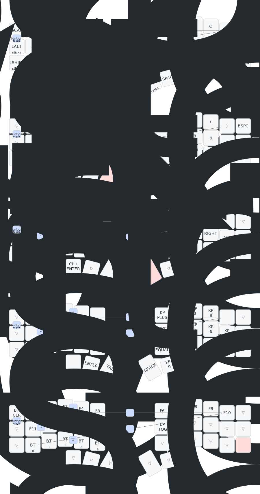

# Corne ZMK Mapping by Mike Szczys

Corne split keyboard mapping driven by [nice!nano v2
Controllers](https://nicekeyboards.com/nice-nano/).



Keymap originally based on the Corne layout [by Mark
Stosberg](https://mark.stosberg.com/markstos-corne-3x5-1-keyboard-layout/).

## Build Instructions

Use the helper scripts to build and flash firmware:

```
# Build firmware
cd app
./autobuild

# Copy firmware to left half
./copyleft

# Copy firmware to right half
./copyright
```

## Manual Build Instructions

```
cd app
west build -d build/left -b nice_nano -p -- -DSHIELD=corne_left
west build -d build/right -b nice_nano -p -- -DSHIELD=corne_right
cp build/left/zephyr/zmk.uf2 /media/mike/NICENANO/.
cp build/right/zephyr/zmk.uf2 /media/mike/NICENANO/.
```

## Visualize keymap

Generate an SVG using [keymap
drawer](https://github.com/caksoylar/keymap-drawer)

### Prerequisite: Install keymap drawer

```
pip install keymap-drawer
```

Alternatively you may use [the web app](https://keymap-drawer.streamlit.app/).

### Generate the visualization

```
cd app
keymap parse -c 10 -z boards/shields/corne/corne.keymap > szczys_corne_mx_zmk.yaml
keymap -c scripts/keymap_drawer_config.yaml draw szczys_corne_mx_zmk.yaml > img/szczys_corne_mx_zmk.svg
```
